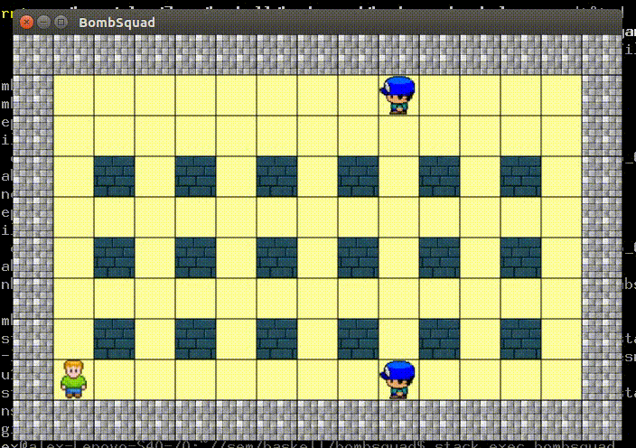

# Bombsquad

2D game with simple rules: just BOOM your enemy

All textures were taken from [https://opengameart.org/](https://opengameart.org/), details in "image" directory



## Build

Using [Stack Utility](https://docs.haskellstack.org/en/stable/README/)
```
stack setup
stack build
```
## Execute

```
stack exec bombsquad
```

## Controls

Space  - place bomb

WASD   - move

Arrows - change sight direction
